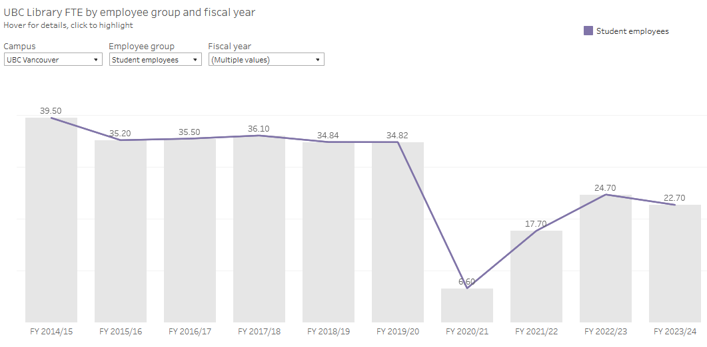
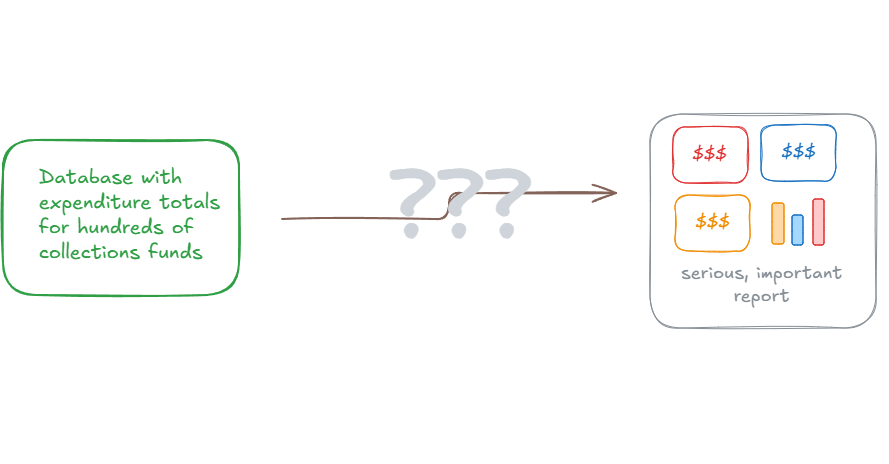
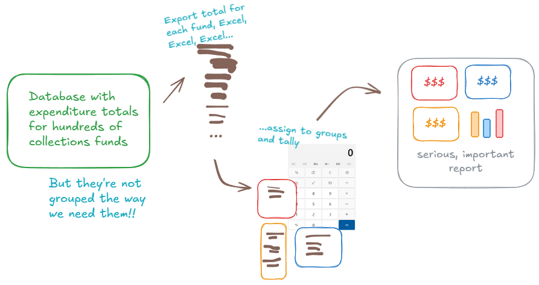
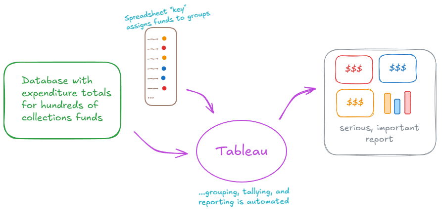
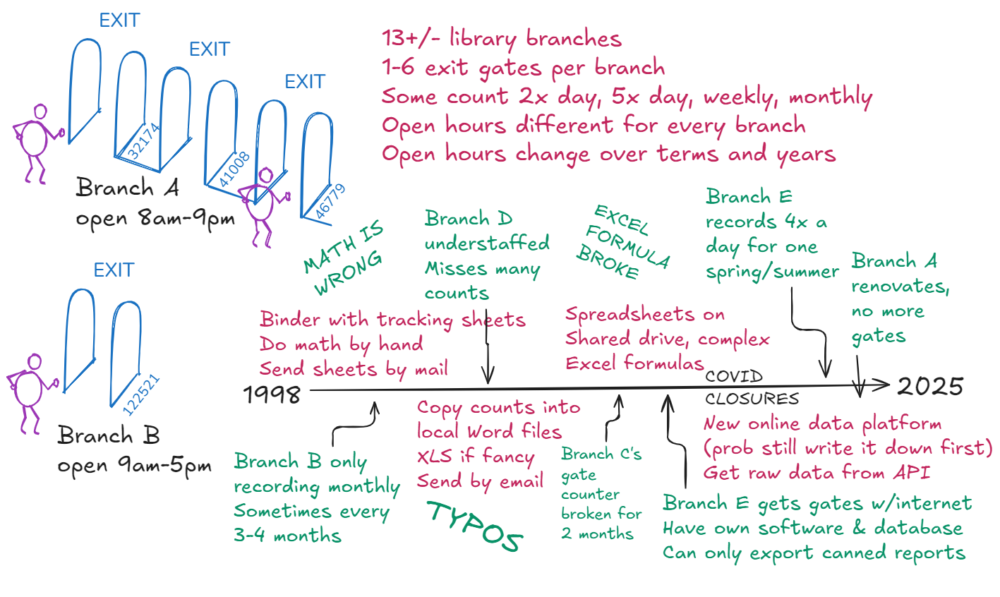
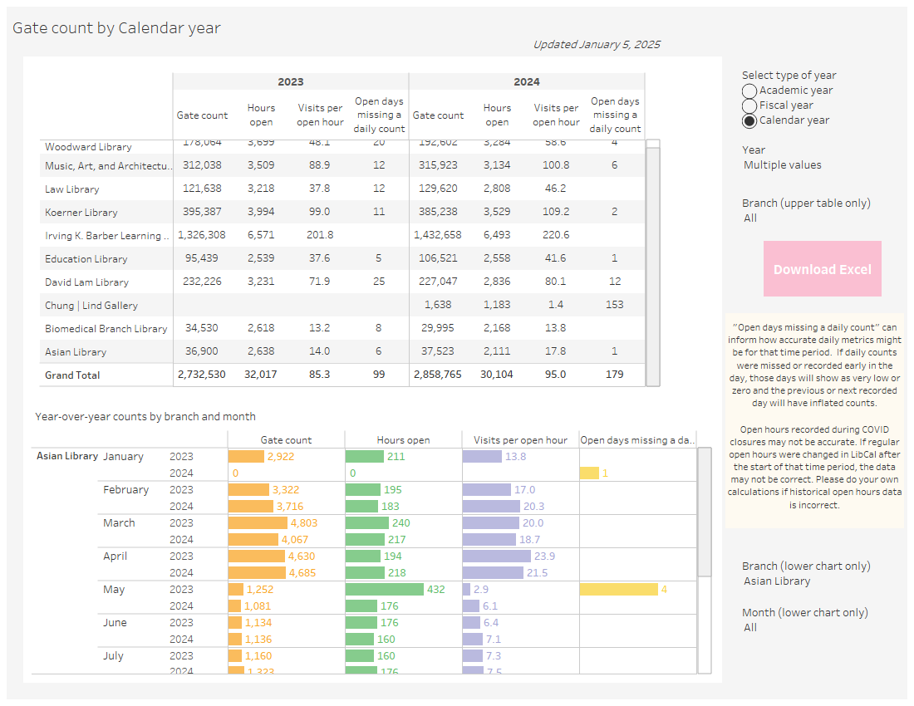

<!-- .slide: data-transition="none-out" -->

## UBC Library operational data 
### Overview for LIBR559S 
\
\
Jeremy Buhler, _Data Librarian_   
Meghan Waitt, _Library Data Analyst_  

notes: Introductions 

---
<!-- .slide: data-background="lightblue" data-transition="none-in slide-out" -->
### What we'll cover

- Types of operational data in academic libraries 
- Value of this data in workflows and planning 
- Guiding principles for handling data 
- Tools and skills that make this possible

notes: In the next 40 minutes or so we'll provide a non-technical introduction to these topics. We'll talk about the kind of operational data you're likely to find in academic libraries, and about the potential value of this data for planning library services or for improving day-to-day workflows. We'll also talk about some of the principles that guide our work. We'll close by sharing two examples from UBC Library of operational data workflows: how we draw often unruly data from various systems to make it meaningful and useful to our colleagues. Those examples will give you an idea of the tools and skills that are helpful in doing this kind of work - many of which are also applicable in Research Data Management. 

As we go though the presentation please stop us if you have questions or observations: we'll leave time for discussion at the end, but your voices are welcome throughout.  

---
### What do we mean by _operational data_?

Data generated in the course of library operations or collected to support operational needs <!-- .element: class="fragment" -->

notes: The focus of Research Data Management is data generated in the course of research, which is often managed by libraries. Unlike RDM, our work is limited to _operational data_ which has a different source and purpose. Here's a working definition of operational data: 

    "Data generated in the course of library operations or collected to support operational needs"

Our work is more closely related to assessment or business intelligence or operational support than it is to RDM, though many of the skills and values are shared. 

---
### The _Library Data Team_

- generates reports for Library employees <!-- .element: class="fragment" -->
- compiles data for statistical surveys <!-- .element: class="fragment" -->
- manages operational data collection <!-- .element: class="fragment" -->
- maintains data reporting platforms <!-- .element: class="fragment" -->

notes: When I say "we" or talk about "our" work, I'm referring to the _Library Data Team_. It's a small team - currently just part of my time and all of Meghan's - but our work is broad in scope. To put it in a sentence, wwe make data about UBC Library operations accessible (and intelligible) to our colleagues across the library. This involves generating reports, compiling data for statistical surveys, managing data gathering, and making sure our data gathering and reporting platforms are configured well and running smoothly. Accomplishing these tasks well in a large, multi-branch library also involves a lot of documentation and training. People come and go, platforms change, operational needs change, and we try to provide enough information so our colleagues can use data responsibly and make good decisions. I'm proud of what our team has been able to accomplish.

---

#### Example: Annual Report to Senate 

<https://about.library.ubc.ca/news/publications/senate-report-2023-2024/> <!-- .element: class="small" -->

notes: At a basic level, operational data compiled by the Library Data Team is reported in annual statistical surveys administered by library associations like ARL, CARL, and ACRL. These surveys allow for comparison among libraries and may be used by administrators when making the case for more funding relative to peer institutions, for example. These measures also appear in reports like the Annual Report to Senate shown here. I suspect you'll agree that these system-wide totals aren't very inspiring or engaging, but behind each total are sources of disaggregated data with much more nuance and potential if approached creatively, and with a genuine interest in understanding and improving our activities.

---
<!-- .slide: data-background="cornsilk" data-transition="slide-in none-out" -->
Tableau report demo

<https://reports.im.it.ubc.ca/> <!-- .element: class="fragment" data-fragment-index="1" -->  
_CWL login, UBC Library employees only_ <!-- .element: class="fragment" data-fragment-index="1" -->

notes: The potential of at least _some_ of this disaggregated data finds expression in the interactive dashboards that the Library Data Team prepares using Tableau software. These online dashboards can update automatically from source data in databases or files, and they're available to all UBC Library employees with CWL credentials. One of the reports that might interest you shows how often files are viewed or downloaded in Abacus, UBC Library's data repository. Abacus is actually an instance of the Dataverse platform - the same back-end that runs Borealis, Canada's national RDM platform. The user interface for Borealis and Abacus provide few options for understanding overall activity in the repository. To create this report I run a SQL query on the Abacus database so I can get detailed data, then group and format it as needed. This is especially useful in our case because Abacus is shared by four instituitons. Not only can we see which items were downloaded most often, but we can limit activity to users from a particular institution.

---
<!-- .slide: data-background="lightblue" data-transition="none-in slide-out" -->
## Streams of operational data

notes: how does opearational data get generated or collected? To simplify it somewhat, we can thing of two data streams.

---

- Generated automatically by library systems  
- Collected/compiled by library employees  

---

<!-- .slide: data-background="cornsilk" -->
### Generated automatically

Collections metadata 
Circulation 
Fines 
Computer workstation use 
Website visits 
Searches 
Gate count(hybrid) 
File downloads 

notes: The first is data that is generated automatically by various library systems in the course of day-to-day activities. Can you think of examples?

---

<!-- .slide: data-background="cornsilk" -->
### Collected by library employees

Patron questions  
Group presentations 
Gate count (hybrid) 
Furniture/seat counts 
Head counts 
Original cataloguing 
In house use 
Project activity  

notes: The second is data collected or compiled by library employees - sometimes to enhance or complement data collected in library systems, but often because there's no practical way to automate data collection. Again, think of examples.

The Library Data Team works with both streams. In the case of the second, we're usually responsible for establishing workflows and guidelines, and coordinating data collection for the entire UBC Library system. An example that some of you may be familiar with is collecting data about patron questions. Interactions with patrons at help desks or online are tracked in software called LibInsight, which the Library Data Team is responsible for.

---
<!-- .slide: data-background="lightblue" data-transition="none-in slide-out" -->
## The value of operational data

notes: So why does this matter? What value does a library get from collecting and managing this kind of data?  

---
<!-- .slide: data-transition="slide-in none-out" -->
### Common drivers

statistical surveys  

planning, workflows, assessment <!-- .element: style="color: white" -->

notes: One common driver for collecting data is statistics reporting. For example, the Association of Research Libraries (ARL) has annual statistical surveys that ask for information about library collections, expenditures, staffing, salaries, interactions with patrons, and so on. In ARL's words, "Libraries use the data to make evidence-based decisions for operations, programs and services, describe their operations and budget expenditures, and demonstrate how resources are used for the benefit of the communties they serve." (<https://www.arl.org/category/our-priorities/data-analytics/arl-statistics-and-salary-surveys/>). Because the survey questions are relatively stable from year to year, we end up with longitudinal data that shows trends and can be useful in planning and advocacy. 

---
<!-- .slide: data-transition="none" -->

#### UBC Library student employee FTE: Vancouver locations

notes: Here's one example showing how the number of student employees UBC Library's Vancouver branches changed in the last decade. This is a static screenshot, but like the shelf list I showed earlier there are filters to select the desired employee groups, years, and campus. The numbers on this graph are FTE, or full time equivalent, where one FTE represents the working hours of a full time employee. We see a big drop during COVID lockdowns, when the number of student employee hours was the equivalent of 6.6 full time positions. That number has increased somewhat since then, but it's nowhere near what it was before COVID. Data like this isn't just available to administrators in charge of funcing - anyone who works at UBC Library can explore the Tableau reports for their own needs or curiosity.       

To help illustrate we'll share two scenarios that involve operational data reporting. In each scenario, emphasize value of data for time-saving, reducing errors, better decision making, etc. _Each example could include images to illustrate how we supported them: e.g. screenshot of a Tableau report, illustration of a data workflow._

---

<!-- .slide: data-transition="fade-in slide-out" -->
### Common drivers

statistical surveys <!-- .element: class="fragment semi-fade-out" data-fragment-index="1" --> 

planning, assessment, workflows  <!-- .element: class="fragment" data-fragment-index="1" -->

notes: Statistical surveys are an _external_ driver for collecting operational data, even though the data is also valuable internally. The second set of drivers listed here are more internal. The operational data we provide supports a wide range of planning and assessment needs. In this context we often hear about the value of data for supporting _evidence-based_ decisions. But something that arguably gets less attention is the value of data access for improving routine workflows in the library. Purpose-built reports that provide data when it's needed, in the appropriate format, can save so much time across a large organization. This kind of data intervention usually has a lower profile, but I believe that the incremental improvements our data support provides is actually our most valuable contribution. To illustrate we have two scenarios.  

---

<!-- .slide: data-background="cornsilk" -->
### Scenario 1
### Collections budget & data

notes: This is a simplified hypothetical example of managing collection budget spending, based on a real scenario in a top Canadian academic library, not naming any names. Imagine you are in a librarian role which includes the responsibility for selecting and purchasing collection materials: ebooks, print books, journal subscriptions, etc. 

---
### Collections budget & data

notes: A specific amount of money is allocated for these purchases. Seems simple enough?

---

### Collections budget & data

notes: Data lives within multiple systems: vendor and publisher platforms, the ILS or LMP (library management platform), and the university's financial systems. The fund allocation for your purchases is actually shared by everyone on your team, each purchasing for multiple subject areas or languages or formats. The fund balances live in the ILS; with other expenditure data in the financial systems; but you create and view your selections and orders in the vendor system, where the fund names and codes are mapped to but not the same as the ILS. You can't tell how much your colleagues have spent already, or on what. How do you manage this spending? ... Some people might keep their own spreadsheets in which they manually transcribe orders and costs and keep track of the math, perhaps collaborating with the rest of their team. It's not ideal: invoiced costs sometimes differ from order prices, there's currency exchange, other charges. It's a lot of manual accounting and trust in a uniform process across many individuals.

---
### Collections budget & data

notes: I can help. Luckily, we have direct access to the ILS and financial databases. Working with the selectors (and their head/manager) we create a spreadsheet dividing up the allocated money into buckets managed by each member of the team, called sub-allocations. I pull all of that data together in a single Tableau report, which updates auotmatically on a daily schedule, so that each sub-allocation can be tracked by you, the selectors. Tableau reporting also allows managers, branch heads, AULs, and finance staff to monitor spending in other ways: print or e, government or endowment funded, tax brackets, shipping, currency of purchase, and so on.

---
<!-- .slide: data-background="cornsilk" -->
### Scenario 2
### Fiscal year financial reporting

notes: On to Scenario #2. I won't pretend to be as discreet as Meghan, this one is based on a recent example from UBC Library that involves an annual report about the library's collections spending. 

---

### Fiscal year financial reporting

notes: It's a high profile report used by library administrators and for year-end expenditure reporting, so getting it right matters. The source data comes from an in-house database that has limited reporting options. What path does it follow to the report?  

---

### Fiscal year financial reporting

notes: Until recently, all the steps between the source database and the final report involved direct work by library employee. Because reporting options were limited, this person had to export totals for each fund, then group the funds and calculate totals, then create the report. The process was not automated and each step (transcribing, grouping, tallying) introduced the risk of error. To say nothing of how much time the process took. So where are we now? 

---

### Fiscal year financial reporting

notes: our tools aren't magic, there's still some manual work involved, but the new approach saves time, reduces the chance of error, and establishes a documented and reproducible process. The manual work is only to create a key that assigns funds to groups (this stays mostly the same each year, updates are only necessary for newly added funds). The rest is handled by Tableau, which is configured to draw directly from the database (bypassing limitations in the export options), group the data using the key, and produce a report with total expenditures by group.

Like I said: this isn't flashy stuff but if you're the person copy/pasting values from one source to another, interventions like this can really lighten the load. Part of the challenge is to help people recognize when a better way might be possible, and contact us to find explore the options. 

---
<!-- .slide: data-background="lightblue" -->
## Guiding principles for handling data

notes: In this section we want ot highlight a few values that inform our work. Some of these principles are data specific and have to do with things like data integrity and data storage. Other This is a good place to talk about our training and documentation efforts, the work it takes to present data responsibly, being available to all library employees, the importance of normalization, the preference for direct access to disagregated data (because out-of-the-box eventually comes up short), etc._

At least some slides in this section could have prompts for student engagement, possibly references to the way that would also apply in RDM (e.g. describing data). I suggest we use our Tableau setup as a recurring thread through this section.

---

### Library Data Team's role as interpreter

- Consultations like reference interviews
- Need to understand library context
- Familiar with technology and tools
- Help others understand what's possible

notes: The Library data team acts as a bridge between library operations/employees and the data. 

---

### Available, intelligible
- Any library employee may request our support
- Published reports have explanatory notes <!-- .element: class="fragment" -->

notes:

---

### Managing data

- Data integrity and cleanup
- Storage and access
- Methods and systems change over time
- Description, communication

notes: Data can be quantitative, qualitative, structured or unstructured. Data integrity: is data good, complete, accurate, consistent? Who created it, how has it managed over time, how well does it represent the real world? How easily or meaningfully can it be accessed and analyzed? Can we improve it by correcting errors, standardizing and normalizing, filling in gaps, reshaping? The context of longitudinal data is of note - libraries do a lot of year-over-year analysis, and we have datasets that go back decades. Data collection methods, analysis and management vary considerably when comparing data from 2005,to 2015, to 2025. Documentation is very important, and often challenging.

---
<!-- .slide: data-background="lightblue" -->
## Operational data workflows

notes: _describe two operational data workflows to help students understand the range of tools involved, and the effort involved in presenting an accessible report or dashboard. The workflows should also include examples of how the data gets used._

---
<!-- .slide: data-background="cornsilk" -->
### Workflow 1
### Cloud -> TSV -> Tableau

notes: 

---
<!-- .slide: data-transition="slide-in none-out" -->
### Google Analytics via API

notes: 

---

### Google Analytics via API

<!-- .slide: data-transition="none-in zoom-out" -->

notes: at the end of every month the Library Data Team takes snapshots of the month's website activity and stores them in TSV files on the T: drive. This happens automatically with Python scripts that harvest selected dimensions and metrics using the Google Analytics API. We don't harvest all the data, but enough to answer many website activity questions.  

---

<!-- .slide: data-transition="zoom-in fade-out" data-background-image="media/tsv_view.png" -->

notes: These TSV files are stored in a T: drive directory that's visible to everyone. Some of the files are large (the pages file has more than 3M rows) and won't open in software like Excel, but they're available to anyone who wants to analyze the data themselves. 

---

<!-- .slide: data-transition="fade-in zoom-out" -->

notes: Most of us will prefer to move along to step three in the diagram, where these TSV files are turned into Tableau reports that are updated every month.

---

<!-- .slide: data-background-image="media/overview_report.png" data-transition="zoom-in none-out" -->

notes: here's an example of one of the Tableau dashboards. This one shows an overview of activity for the entire Library website from July 2023 to May 2024. Across the top you can filter by dimensions including the date, session source, device category, and medium. Even at a glance you can see that the overview graphs reflect the academic schedule, with a decrease in activity during the summer months and over the winter break.

---

<!-- .slide: data-background="cornsilk" -->
### Workflow 2
### Gate Counts

notes: "Gate count" is a standardized definition set by ARL: "the number of persons who physically enter the library in a year." This statistic is included in the annual Report to the Senate, as well as many annual statistical surveys administered by academic library organizations such as ARL, CARL, CPSLD, and others. 

---

### Gate Counts

notes: At UBC Library, we collect daily counts of patrons entering the branches as recorded by electronic gates at entrances. This usually requires noting the number on the electronic counter before the library opens and at the end of the day after closing, at a minimum. The actual gates have different manufacturers depending on when they were installed; some count entrances and exits, some exits only. Their counters have digit limits and reset after a certain number, e.g. 100,000. The data can be used to inform decisions on desk staffing, open hours, and other public services. Seems simple enough? Of course not...

---

### Gate Counts

notes: Surprise: this is _still_ an oversimplified representation of managing gate count data. Multiple library branches, some of which have no gates, some one, some multiple; some count twice per day, some multiple times per day, and there can be gaps; open hours are different for each branch, term, year. All of the variables change over each year, each term, and even day-to-day depending on staffing practices or any interruptions to regular routines. The timeline represents a small selection of factors that help provide context to the data: methods varying from recording and calculating by hand to automatic collection. Even with LibInsight, our online platform, most people probably jot down numbers on paper and/or use a calculator to get the count from the physical gate counter screen to the digital record. You might think having the gates automatically load data into a database would be preferable; there are pros and cons: it's more expensive, a separate system/vendor/software, and the database exports canned reports in one format that can't be edited.

---

### Gate Counts

notes: When we migrated to LibInsight, we worked on big project to clean, merge, reshape and analyze the gate count data from the past ten or so years, most of which came from spreadsheets manually maintained by staff. Cleaning was important: checking each dataset for major outliers, interpolating and correcting typos, adjusting or annotating batch entries so that reports don't look like 4,000 people visited our smallest, quietest branch on a single day in July 2011. This historical data is then unioned with current, active data we extract out of LibInsight via API (which also gets archived annually). I've also brought in Open Hours data, which lives in a database managed by Library IT and updated by staff. The Tableau report is accessible to all staff online and updates automatically. We use this for the core purpose of getting the single ARL stat of "how many people visit the library in a year" as well as vizualizations, access to raw data, and detailed, granular analysis of all fields: e.g. average gate count on weekdays vs. weekends, or visits per hour in a year.

---

### Gate Counts

notes: Here's one of the dashboards from the Tableau report. This shows gate count, hours open, and visits per open hour in 2023 and 2024. Think about meaning and context: what does it mean for a branch to be busy? Can you say one branch is busier than another, or that visits have increased from one year to the next? If you have a similar number of visitors in 2023 and 2024, but in 2024 the open hours were reduced signficantly, we would see a significant increase in "visits per open hour" (though little to no change to the total number of visitors in the year). This is an example of normalizing to a common denominator to allow meaningful comparisons and analysis, and help inform planning and decision-making like "should we stay open until 6pm or 9pm"?

---

## Questions?
#### _and thank you_
