<!-- .slide: data-background="steelblue" data-transition="none-in none-out" -->
# Data visualization: principles and tools
<br/><br/>
  
**Jeremy Buhler**  
*Data Librarian, UBC Library Research Commons*  
jeremy.buhler@ubc.ca <!-- .element style="color:lightblue" --> 
<br/>
slides: https://bit.ly/CHBE201 <!--.element style="color: lightblue" -->


Note:

---

<!-- .slide: data-transition="none-in slide-out" -->
## Learning objectives

- Understand the purpose of data visualization <!-- .element class="fragment" --> 
- Recognize characteristics of effective visualizations <!-- .element class="fragment" -->
- Learn about common plot types<!-- .element class="fragment" -->
- Compare visualization tools <!-- .element class="fragment" -->


notes:  

---

<!-- .slide: data-background="lightblue" data-transition="slide-in none-out" -->
## Outline 

- Why visualize data? 
- Principles of effective visualization  
- Plot types  
- Scatterplot example   
- Visualization tools 

Note:

---

<!-- .slide: data-background="orange" data-transition="none-in slide-out" -->
## Why visualize data?

Notes: So why _do_ we visualize data? I like to start with this basic question because visualizaton has different purposes depending on the context, so it's important to be clear about our intention.

---

<!-- .slide: data-background-iframe="https://www.visualcinnamon.com/art/gdqs/" data-background-interactive -->

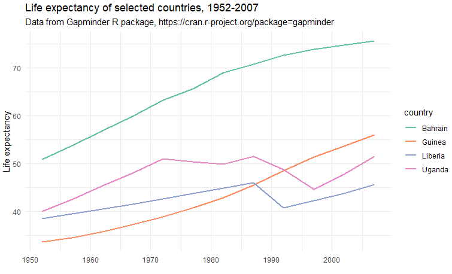 <!-- .element class="fragment" -->

Notes: In the context of this class and presentation, the main purpose of data visualization is to _communicate_. Aesthetics and creativity are components of well rounded visualizations, but when deciding how to present your data I encourage you to prioritize the clarity of your message. You will come across more artistic visualization examples, some of which may be beautiful and inspiring, but keep your audience and your message front of mind. What you see on the screen is an innovative visual representation of people's diets, but to understand it most users would need to read the fine print (scroll) and take time to _learn_ about the project. 

Now compare that to a much more familiar line graph. More boring? Probably. But in many contexts our audiences won't take the time to _learn_ how to engage with our visualization. We need something that draws the viewer's attention straight to the point, almost intuitively, without much effort on their part. It's this less flashy type of visualization we'll focus on today.  

--
 
R code to generate the line graph on slide above; assumes dplyr, ggplot2, and gapminder, packages are installed and loaded. <!-- .element: class="small" -->

```r
gapminder %>%
  filter(country %in% c("Bahrain","Guinea","Liberia","Uganda")) %>%
  ggplot(aes(x = year, y = lifeExp, color = country)) +
  geom_line(size = 1) +
  labs(
   title = "Life expectancy of selected countries, 1952-2007",
   subtitle = "Data from Gapminder R package, https://cran.r-project.org/package=gapminder",
   x = "",
   y = "Life expectancy") +
   scale_color_brewer(palette = "Set2") +
  theme_minimal()
```

---

> “Data visualization is the graphical display of abstract information for two purposes: sense-making (also called data analysis) and communication.”  
>
> — *Stephen Few,* [*What is Data Visualization*](https://www.perceptualedge.com/blog/?p=2636)

Note:
Stephen Few and Alberto Cairo are two authors who have shaped my own approach to visualization (there's a resource slide at the end with their names). This quote from Stephen Few is a good place to start when considering the purpose of visualization. 

---

<!-- .slide: data-transition="slide-in none-out" -->
## Purpose of visualization

- Explore to identify trends and patterns 
- Communicate your findings to others <!-- .element class="fragment" -->

Note: 
- Skillfull visualization makes it easier to explore and understand what’s going on in our data: that's the **sense-making** purpose from Stephen Few's definition.  
- And a good visualization can also improve the **communication** of our findings by drawing attention to the patterns, relationships, and stories we choose to highlight.  

It's not just about making pretty things - it's about seeing, understanding, and communicating.

---

<!-- .slide: data-background="orange" data-transition="none-in slide-out" -->
## Principles of Effective Visualization

Note: So how does it work? Fortunately, there are a few basic principles that anyone can apply to enhance the clarity and effectiveness of visual representations of data.  

---

<!-- .slide: data-transition="slide-in fade-out" -->
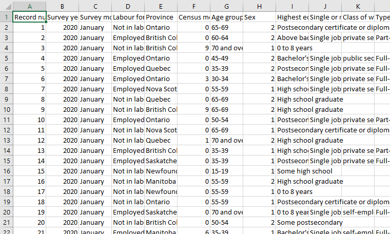 

Note: 
There are many content and design choices to make when going from source data about employment in Canada...

---

<!-- .slide: data-transition="fade-in slide-out" -->
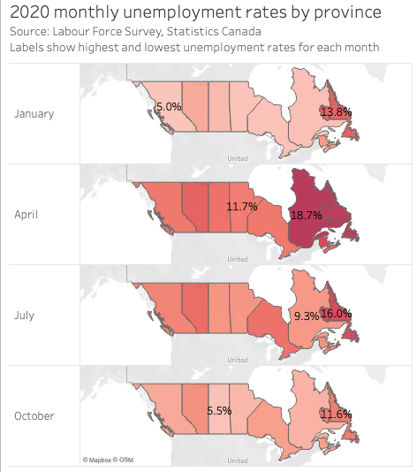

Note:
...to a map that shows the fluctuation of unemployment rates in the first full year of COVID. This is a map I made using Tableau software, which we'll discuss later. Some of what makes this map work is that it taps into...  

---

### Preattentive processing

Note:
...what's called preattentative processing. That's the "eye and brain’s ability to process certain visual properties almost instantly, without conscious effort." In other words, there are some kinds of visual cues that most people notice instantly, without thinking about it: it's just _there_. Using those cues intentionally, in service to your message, can strengthen your visualizations. 

---

  
 <!-- .element: class="fragment" -->

<span class="small fragment">Figures on this and the next slide from Stephen Few, “Tapping the Power of Visual Perception”  
[http://www.perceptualedge.com/articles/ie/visual_perception.pdf](http://www.perceptualedge.com/articles/ie/visual_perception.pdf)</span>

Note:
Let me illustrate. Tell me how many times the number five appears in this block. This task is possible, but it takes effort and it's easy to lose track. 

Now try again. The question is almost absurd this time because it's so obvious: the five's are just there. Because they're darker the eye can pick them out instantly. 

The figures on this and the next slide are again from Stephen Few. 

---

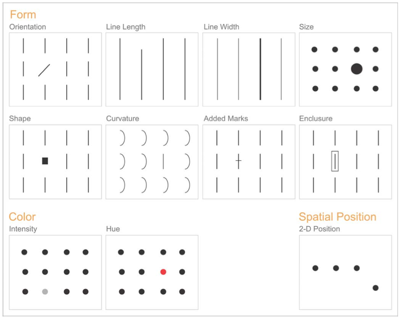

Notes:
It turns out that color intensity - making the fives darker - is just one of many preattentive properties we can employ to communicate visually. This slide illustrates several others, and they can be combined to encode multiple layers of information in a small visual field.   

While they're all preattentive properties, some are better suited than others to certain tasks, and some might not be perceived the same by all viewers. There's an entire world to explore here, but I'll share a few tips.

---

Encoding quantities: **length** and **size**

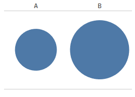 <!-- .element: class="fragment" -->
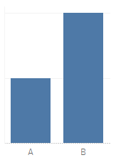 <!-- .element: class="fragment" -->

Notes:
Both line length and size are preattentive properties shown on the previous slide, but when encoding quantities it's usually better to use length. That's because we tend not be be very good at estimating relative areas.

click: in this case we can tell that B is bigger than A, but I find it hard to say be how much.

click: the bar plot, in contrast, makes it crystal clear: A represents half as much as B. This is one reason to favor bar graphs over pie charts. 

---

Remove unnecessary content to **focus** the viewer
 <!-- .element: class="fragment" -->
 <!-- .element: class="fragment" -->

Note: 
This next tip isn't about preattentive processing itself, but it's about clearing the way for the viewer. Stephen Few uses the phrase "reduce non-data ink." 

click: this bar graph isn't bad, but it can be improved by removing unecessary or redundant elements, and by de-emphasizing others. Ideally the viewer will be able to focus more quickly on what you want to communicate...

click: this second example has exactly the same information but is cleaner. The months move to the bottom: still there but out of the way. The percentage axis label isn't necessary because each bar is already labeled, so they're gone. The reader doesn't need exact figures, so the labels are rounded to a 10th of a percent. The result is a visualization that's more direct and pleasant to engage with.

---

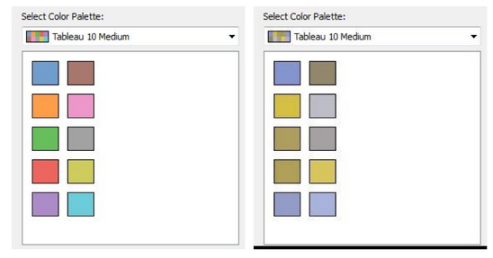

<span class="small">Source: Jeffrey Shaffer, [https://www.tableau.com/about/blog/2016/4/examining-data-viz-rules-dont-use-red-green-together-53463](https://www.tableau.com/about/blog/2016/4/examining-data-viz-rules-dont-use-red-green-together-53463)</span>

Notes:
So far the examples I've show are just one color, but if you're using multiple colors be attentive to color blindness. It can be tempting to use the colors that look best to you, but an estimated 8% of men and 2% of women experience some form of red/green colorblindness. In this image, the palette on the right is a similuation of what someone with colorblindness might see when you use the palette on the left. To safeguard agains this, many visualization tools provide palettes that are colorblind friendly. 


---

Use colors intentionally to **encode information**

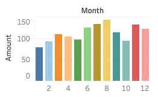 <!-- .element: class="fragment" -->
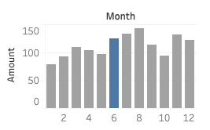 <!-- .element: class="fragment" -->

Note:
Another tip about color: it's a useful way to encode information, so try not to waste it where it's not necessary. In this example the months are already identified by their numbers and sequence. In such a case, the decision to add color is purely aesthetic and doesn't carry a data message. But if you save color to encode something else you have another tool at your disposal: for example, to call your viewer's attention to something special about the month of June.

---

Provide enough context to **orient the viewer**  

- title
- legend
- axis labels
- time period
- data source
- author
- ...

Note:
My last tip for data visualizations is to remember to give enough context. You don't want to frustrate a viewer, it's important to give them everything they need to make sense of the visualizaition and understand your message. Sometimes that means your image will be more cluttered than you'd like... always keep the communicative purpose of your visualization in mind, and prioritize understanding over aesthetic choices.

---

<!-- .slide: data-background="ligthblue" data-transition="slide-in none-out" -->
### Some guiding principles

1. Understand your goal
2. Choose clarity over variety  
2. Reduce burden on the viewer
3. Provide sufficient context

Note:

To reinforce that message, here are some guiding principles.

---

<!-- .slide: data-background="orange" data-transition="none-in slide-out" -->
# Plot types 

Notes: 
Let's shift gears. Now you have some ideas about how to use shape, color, length, and other preattentive properties. Let's look at some common plot types. 
 
---

<div style="padding: 5%; background-color:BlanchedAlmond;">
<p>Data from <em>Gapminder</em> R package</p>
<p class="small">"For each of 142 countries [...] values for life expectancy, GDP per capita, and population, every five years, from 1952 to 2007."<br/><br/> <a style="color:blue" href="https://cran.r-project.org/package=gapminder">https://cran.r-project.org/package=gapminder</a></p>
</div>

Notes: data source

---

### Histogram
Show the **distribution** of one numeric variable

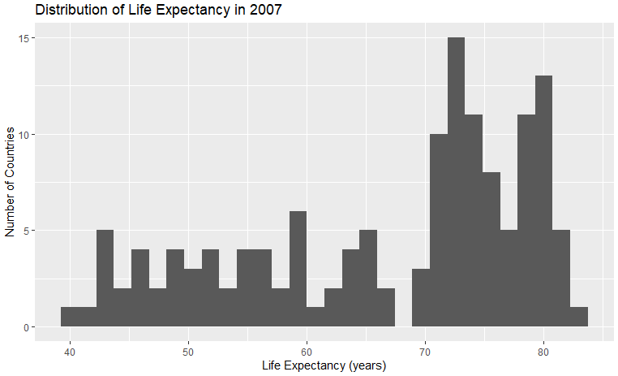


Note:
Use to check shape and skew
A histogram shows how values are distributed across intervals. Adjusting bin width changes the level of detail. The goal is to reveal the underlying pattern, not every small fluctuation.

--

Assumes dplyr, ggplot2, and gapminder, packages are installed and loaded. The gapminder_subset created below is also used in subsequent plots. <!-- .element: class="small" -->

```r
# create subset with desired data
gapminder_subset <- gapminder %>%
  filter(year == 2007, continent !- "Oceania")

# create histogram from subset 
gapminder_subset %>% ggplot(aes(x = lifeExp)) +
geom_histogram() +
labs(title = "Distribution of Life Expectancy in 2007",
  x = "Life Expectancy (years)",
  y = "Number of Countries")
```

---

### Density plot
Shows the **distribution** as a smooth curve.

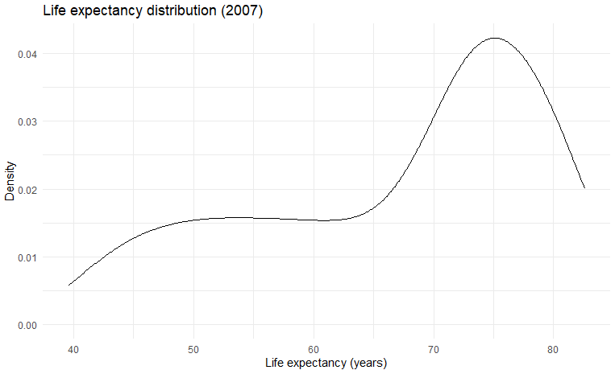

Note:
- Compare distributions between groups  
- See overlap or separation  
Density plots are smoother than histograms and make group comparisons easier, but they abstract away actual frequencies.

--

### Density plot
Shows the **distribution** as a smooth curve.

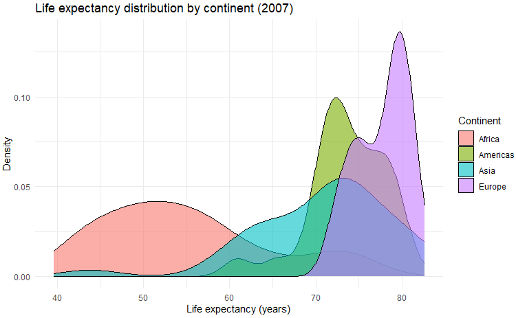

Note:

--

```r
# single-line density plot 
gapminder_subset %>%
  ggplot(aes(x = lifeExp)) +
  geom_density() +
  labs(title = "Life expectancy distribution (2007)",
    x = "Life expectancy (years)",
    y = "Density") +
  theme_minimal()

# multi-colour density plot
gapminder_subset %>%
  ggplot(aes(x = lifeExp, fill = continent)) +
  geom_density(alpha = 0.6) +
  labs(title = "Life expectancy distribution by continent (2007)",
       x = "Life expectancy (years)",
       y = "Density",
       fill = "Continent") +
  theme_minimal()
```

---

### Bar plot
Compare **values across categories**

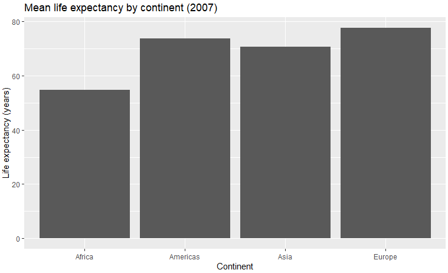

Note:
Use for
- Comparing group means or totals  
- Showing categorical differences  

Barplots make category comparisons easy to see, but they hide the underlying data distribution. Consider adding points or boxplots when variation matters.

--

```r

gapminder_subset %>%
ggplot(aes(x = continent, y = lifeExp)) +
  stat_summary(fun = "mean", geom = "bar") +
  labs(title = "Mean life expectancy by continent (2007)",
       x = "Continent",
       y = "Life expectancy (years)")
```

---

### Boxplot
Show **spread and outliers** across categories

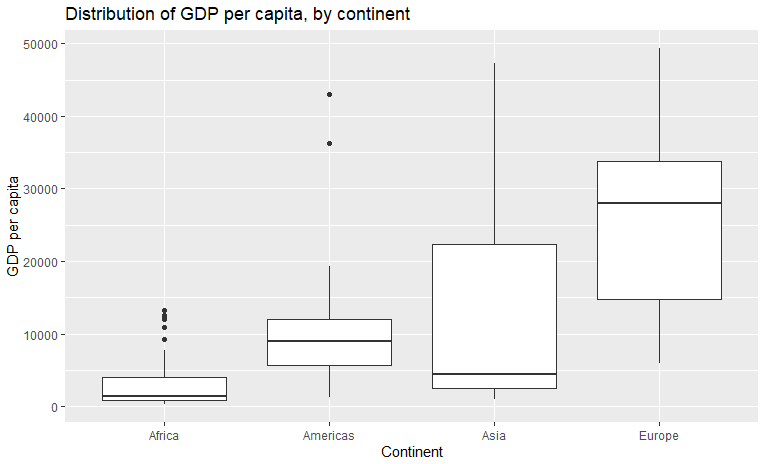

Note:
- Compare distribution between groups  
- Spot medians, quartiles, and outliers  
Boxplots summarize variation compactly. The box shows the interquartile range (middle 50%), the line marks the median, and points beyond the whiskers indicate potential outliers.

--

```r
gapminder_subset %>%
  ggplot(aes(x = continent, y = gdpPercap)) +
  geom_boxplot()+
  labs(title = "Distribution of GDP per capita, by continent",
       x = "Continent",
       y = "GDP per capita")
```

---

### Violin plot
Combines boxplot and density information

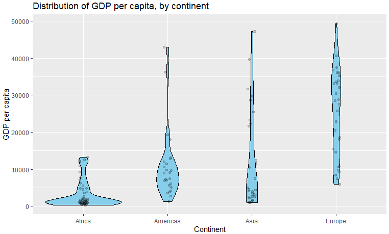


Note:
- Show data spread and symmetry  
- Compare distributions visually  
A violin plot conveys both summary statistics and distribution shape — helpful when groups differ not only in mean but in variability.

--

```r
gapminder_subset %>%
  ggplot(aes(x = continent, y = gdpPercap)) +
  geom_violin(fill = "skyblue", color = "black") +
  geom_jitter(width = 0.05, alpha = 0.2) +
  labs(title = "Distribution of GDP per capita, by continent",
       x = "Continent",
       y = "GDP per capita")
```

---

### Line graph
Show **trend over a continuous variable** (often time)


Note:
Use for temporal patterns or continuous measurements  
Line graphs work well when order matters. They show continuity, unlike bar charts which imply separate categories.

--

```r
gapminder %>%
  filter(country %in% c("Bahrain","Guinea","Liberia","Uganda")) %>%
  ggplot(aes(x = year, y = lifeExp, color = country)) +
  geom_line(size = 1) +
  labs(
    title = "Life expectancy of selected countries, 1952-2007",
    x = "Year",
    y = "Life expectancy") +
  theme_minimal()
```

---

<!-- .slide: data-transition="slide-in none-out" -->
### Scatterplot
Display **relationship between two numeric variables**

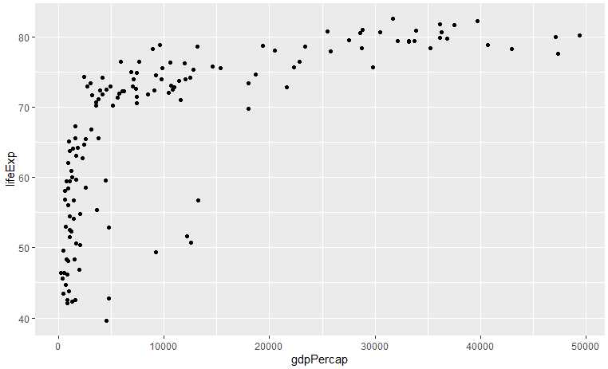


Note:
- Correlation and pattern detection  
- Identifying outliers  

Scatterplots are powerful for exploring relationships. Each point is one observation — nothing is aggregated or hidden.

--

```r
gapminder_subset %>% 
  ggplot(aes(x = gdpPercap, y = lifeExp)) +
  geom_point()
```

---

<!-- .slide: data-background="orange" data-transition="none-in fade-out" -->
## Scatterplot: make it better

---

<!-- .slide: data-transition="fade-in fade-out" -->


---

<!-- .slide: data-transition="fade-in fade-out" -->
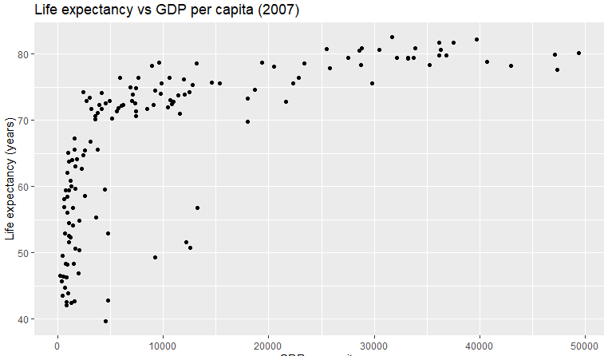

---

<!-- .slide: data-transition="fade-in fade-out" -->
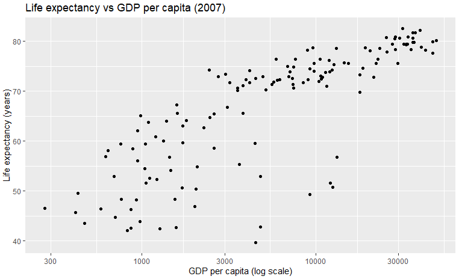

---

<!-- .slide: data-transition="fade-in fade-out" -->
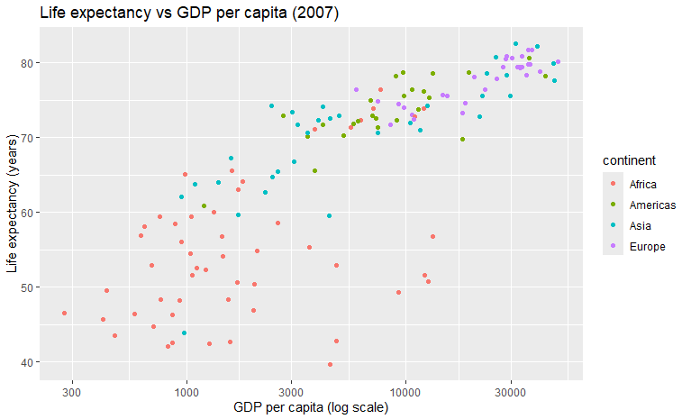

---

<!-- .slide: data-transition="fade-in fade-out" -->
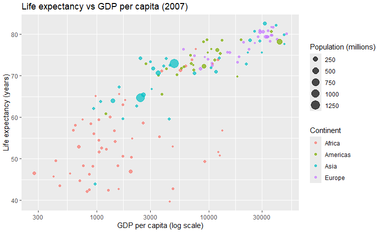

---

<!-- .slide: data-transition="fade-in fade-out" -->
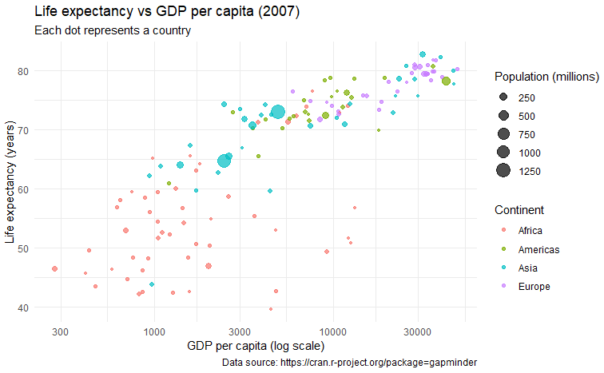

notes:

```r
gapminder_subset %>% 
  ggplot(aes(x = gdpPercap, y = lifeExp,
             color = continent, size = pop / 1e6)) +
  geom_point(alpha = 0.7) +
  scale_x_log10() +
  labs(title = "Life expectancy vs GDP per capita (2007)",
       subtitle = "Each dot represents a country",
       x = "GDP per capita (log scale)",
       y = "Life expectancy (years)",
       color = "Continent",
       size = "Population (millions)",
       caption = "Data source: https://cran.r-project.org/package=gapminder") +
  theme_minimal()
```

---

<!-- .slide: data-background="orange" data-transition="none-in slide-out" -->
## Visualization tools

---

<!-- .slide: data-background="lightblue" -->
### Selection criteria
- Ease of use
- Reproducibility
- Flexibility of design
- Integration

Note:
No single tool is “best.” Your choice depends on goals, data complexity, and audience.

---

### Excel

- \+ familiar and quick to learn  
- \+ can do simple plots  
- \- not reproducible  
- \- not as flexible

Note:
Excel remains ubiquitous, but be cautious with its defaults. Always prioritize clarity over decoration.

---

### R 

- \+ reproducible  
- \+ flexible and customizable
- \+ freely available
- \- steeper learning curve  
- \- requires scripting

Note:
R’s `ggplot2` is based on a “grammar of graphics.” Once you learn its logic, it’s extremely powerful and consistent.

---

## Tableau

- \+ produce interactive reports  
- \+ drag-and-drop interface  
- \- limited reproducibility  
- \- free versions are limited  

Note:
Tableau excels at communicating results interactively — but less so for scripted, version-controlled workflows.


---

<!-- .slide: data-background="lightblue" -->
## Key Messages

- Visualize to *explore* and *communicate*   
- Design with *clarity* and *simplicity*  
- Choose appropriate  *plot types*
- Consider *reproducibility*   

Note:
Each time you look at or make a graph, ask: What question is it answering? What am I trying to communicate? 

---

<!-- .slide: data-transition="slide-in none-out" -->
## Selected resources

- Stephen Few, [*Show me the numbers: designing tables and graphs to enlighten*](https://resolve.library.ubc.ca/cgi-bin/catsearch?bid=6167222)
- Alberto Cairo, [*How charts lie: getting smarter about visual information*](https://resolve.library.ubc.ca/cgi-bin/catsearch?bid=10081648)  
- Hadley Wickham, [*ggplot2: Elegant graphics for data analysis*](https://ggplot2-book.org/)   

---

<!-- .slide: data-background="steelblue" data-transition="none" -->
## Thank You

**Jeremy Buhler**  
*Data Librarian, UBC Library Research Commons*  
jeremy.buhler@ubc.ca <!-- .element style="color:lightblue" --> 

