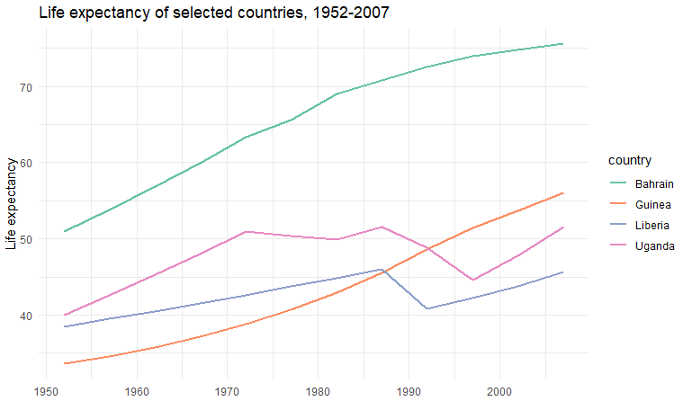

<!-- .slide: data-background="steelblue" data-transition="none-in none-out" -->
# Data visualization: principles and tools
<br/><br/>
  
**Jeremy Buhler**  
*Data Librarian, UBC Library Research Commons*  
jeremy.buhler@ubc.ca <!-- .element style="color:lightblue" --> 
<br/>
slides: https://bit.ly/CHBE201 <!--.element style="color: lightblue" -->


Note:

---

<!-- .slide: data-transition="none-in slide-out" -->
## Learning objectives

- Understand the purpose of data visualization <!-- .element class="fragment" --> 
- Recognize characteristics of effective visualizations <!-- .element class="fragment" -->
- Learn about common plot types<!-- .element class="fragment" -->
- Compare visualization tools <!-- .element class="fragment" -->


notes: 

---

<!-- .slide: data-background="lightblue" data-transition="slide-in none-out" -->
## Outline 

- Why visualize data? 
- Principles of effective visualization  
- Plot types  
- Scatterplot example   
- Visualization tools 

Note:

1.	Introduction. Describe dual purposes of visualization: a) to explore and identify patterns, and b) to communicate findings. Communicate the scope and purpose of the presentation: to provide a foundation to help students in future self-directed learning, with emphasis on quantitative data graphs used in academic publications. 
2.	Principles of effective visualization. Introduce pre-attentive visual processing to explain why some visualizations are more effective than others. List considerations when creating graps and plots, with emphasis on clarity and simplicity (for sample content see https://ubc-library-rc.github.io/tableau-intro/content/introduction.html)
3.	Graph/plot types for quantitative data visualization. Briefly introduce the following, with examples and use cases: histogram, bar plot, line graph, scatterplot, density plot, violin plot.  
4.	Scatterplot example. Focus on scatterplots to illustrate some of the principles covered in section #2. Show multiple versions of the plot, incrementally improving it by changing the display and contextual elements. I suggest doing this in R and providing the code as a supporting resource, to illustrate how flexible the ggplot R package is. 
5.	Tools for creating visualizations. Things to consider when choosing software for visualization (e.g. ease of use, reproducibility of output, design flexibility). Discuss three options in more detail (Excel, R, and Tableau) with examples and pros/cons of each.

---

<!-- .slide: data-background="orange" data-transition="none-in slide-out" -->
## Why visualize data?

---

<!-- .slide: data-background-iframe="https://www.visualcinnamon.com/art/gdqs/" data-background-interactive -->

 <!-- .element class="fragment" -->


--
 
R code to generate the line graph on slide above; assumes dplyr, ggplot2, and gapminder, packages are installed and loaded. <!-- .element: class="small" -->

```r
gapminder %>%
  filter(country %in% c("Bahrain","Guinea","Liberia","Uganda")) %>%
  ggplot(aes(x = year, y = lifeExp, color = country)) +
  geom_line(size = 1) +
  labs(
   title = "Life expectancy of selected countries, 1952-2007",
   subtitle = "Data from Gapminder R package, https://cran.r-project.org/package=gapminder",
   x = "Year",
   y = "Life expectancy") +
  theme_minimal()
```

---

> “Data visualization is the graphical display of abstract information for two purposes: sense-making (also called data analysis) and communication.”  
>
> — *Stephen Few,* [*What is Data Visualization*](https://www.perceptualedge.com/blog/?p=2636)

Note:
This workshop emphasizes the role data visualization plays in the two activities identified above. Visualization makes it easier to explore and understand what’s going on in our data, fulfilling the **sense-making** purpose.  
It can also improve the **communication** of our findings by drawing attention to the patterns, relationships, and stories we choose to highlight.  
Data visualizations are often attractive, but it isn’t primarily their visual appeal that makes them work. A chart or graph that communicates effectively taps into the processes of perception and cognition. To create and recognize good visualizations it will help to understand a few concepts.

---

<!-- .slide: data-transition="slide-in none-out" -->
## Purpose of visualization

- Explore to identify trends and patterns <!-- .element class="fragment" -->
- Communicate your findings to others <!-- .element class="fragment" -->

Note: It's not just about making pretty things. Reinforce that we're doing this in an academic setting - it's about seeing, understanding, and communicating.

---

<!-- .slide: data-background="orange" data-transition="none-in slide-out" -->
## Principles of Effective Visualization

---

<!-- .slide: data-transition="slide-in fade-out" -->
 

Note:

---

<!-- .slide: data-transition="fade-in slide-out" -->


---

### Preattentive processing

The eye and brain’s ability to process certain visual properties almost instantly, without conscious effort.

---

  
 <!-- .element: class="fragment" -->

<span class="small fragment">Figures on this and the next slide from Stephen Few, “Tapping the Power of Visual Perception”  
[http://www.perceptualedge.com/articles/ie/visual_perception.pdf](http://www.perceptualedge.com/articles/ie/visual_perception.pdf)</span>

---


---

Encoding quantities: **length** and **size**

 <!-- .element: class="fragment" -->
 <!-- .element: class="fragment" -->

---

Remove unnecessary content to **focus** the viewer

 <!-- .element: class="fragment" -->
 <!-- .element: class="fragment" -->

---


<span class="small">Source: Jeffrey Shaffer, [https://www.tableau.com/about/blog/2016/4/examining-data-viz-rules-dont-use-red-green-together-53463](https://www.tableau.com/about/blog/2016/4/examining-data-viz-rules-dont-use-red-green-together-53463)</span>

---

Use colors intentionally to **encode information**

 <!-- .element: class="fragment" -->
 <!-- .element: class="fragment" -->

---

Provide enough context to **orient the viewer**  

- title
- legend
- axis labels
- time period
- data source
- author
- ...

---

<!-- .slide: data-background="ligthblue" data-transition="slide-in none-out" -->
### Some guiding principles

1. Understand your goal
2. Choose clarity over variety  
2. Reduce burden on the viewer
3. Provide sufficient context

Note:

When creating a visualization, ask:

- What’s the main message?  
- Does each element serve that message?  
- Could I remove anything without losing meaning?  

Reducing non-data ink, prove enough context to present data with integrity
Visual variety can be appealing, but ensure that it also serves the communicative and sense-making purposes of your visualizations.  
We increase the credibility and integrity of our work by citing data sources and avoiding intentionally misleading displays.  
(For more about this see Alberto Cairo’s book *[How Charts Lie: Getting Smarter About Visual Information](http://resolve.library.ubc.ca/cgi-bin/catsearch?bid=10081648)*.)

Effective visuals:
- Use pre-attentive cues to emphasize key patterns  
- Reduce cognitive effort  
- Guide the viewer’s eye intentionally  

Ineffective visuals:
- Overload the viewer  
- Create confusion or distraction  

---

<!-- .slide: data-background="orange" data-transition="none-in slide-out" -->
# Plot types 

---

<div style="padding: 5%; background-color:BlanchedAlmond;">
<p>Data from <em>Gapminder</em> R package</p>
<p class="small">"For each of 142 countries [...] values for life expectancy, GDP per capita, and population, every five years, from 1952 to 2007."<br/><br/> <a style="color:blue" href="https://cran.r-project.org/package=gapminder">https://cran.r-project.org/package=gapminder</a></p>
</div>


---

### Histogram
Show the **distribution** of one numeric variable


Note:
Use to check shape and skew
A histogram shows how values are distributed across intervals. Adjusting bin width changes the level of detail. The goal is to reveal the underlying pattern, not every small fluctuation.

--

Assumes dplyr, ggplot2, and gapminder, packages are installed and loaded. The gapminder_subset created below is also used in subsequent plots. <!-- .element: class="small" -->

```r
# create subset with desired data
gapminder_subset <- gapminder %>%
  filter(year == 2007, continent !- "Oceania")

# create histogram from subset 
gapminder_subset %>% ggplot(aes(x = lifeExp)) +
geom_histogram() +
labs(title = "Distribution of Life Expectancy in 2007",
  x = "Life Expectancy (years)",
  y = "Number of Countries")
```

---

### Density plot
Shows the **distribution** as a smooth curve.


Note:
- Compare distributions between groups  
- See overlap or separation  
Density plots are smoother than histograms and make group comparisons easier, but they abstract away actual frequencies.

--

### Density plot
Shows the **distribution** as a smooth curve.


Note:

--

```r
# single-line density plot 
gapminder_subset %>%
  ggplot(aes(x = lifeExp)) +
  geom_density() +
  labs(title = "Life expectancy distribution (2007)",
    x = "Life expectancy (years)",
    y = "Density") +
  theme_minimal()

# multi-colour density plot
gapminder_subset %>%
  ggplot(aes(x = lifeExp, fill = continent)) +
  geom_density(alpha = 0.6) +
  labs(title = "Life expectancy distribution by continent (2007)",
       x = "Life expectancy (years)",
       y = "Density",
       fill = "Continent") +
  theme_minimal()
```

---

### Bar plot
Compare **values across categories**


Note:
Use for
- Comparing group means or totals  
- Showing categorical differences  

Barplots make category comparisons easy to see, but they hide the underlying data distribution. Consider adding points or boxplots when variation matters.

--

```r

gapminder_subset %>%
ggplot(aes(x = continent, y = lifeExp)) +
  stat_summary(fun = "mean", geom = "bar") +
  labs(title = "Mean life expectancy by continent (2007)",
       x = "Continent",
       y = "Life expectancy (years)")
```

---

### Boxplot
Show **spread and outliers** across categories


Note:
- Compare distribution between groups  
- Spot medians, quartiles, and outliers  
Boxplots summarize variation compactly. The box shows the interquartile range (middle 50%), the line marks the median, and points beyond the whiskers indicate potential outliers.

--

```r
gapminder_subset %>%
  ggplot(aes(x = continent, y = gdpPercap)) +
  geom_boxplot()+
  labs(title = "Distribution of GDP per capita, by continent",
       x = "Continent",
       y = "GDP per capita")
```

---

### Violin plot
Combines boxplot and density information


Note:
- Show data spread and symmetry  
- Compare distributions visually  
A violin plot conveys both summary statistics and distribution shape — helpful when groups differ not only in mean but in variability.

--

```r
gapminder_subset %>%
  ggplot(aes(x = continent, y = gdpPercap)) +
  geom_violin(fill = "skyblue", color = "black") +
  geom_jitter(width = 0.05, alpha = 0.2) +
  labs(title = "Distribution of GDP per capita, by continent",
       x = "Continent",
       y = "GDP per capita")
```

---

### Line graph
Show **trend over a continuous variable** (often time)




Note:
Use for temporal patterns or continuous measurements  
Line graphs work well when order matters. They show continuity, unlike bar charts which imply separate categories.

--

```r
gapminder %>%
  filter(country %in% c("Bahrain","Guinea","Liberia","Uganda")) %>%
  ggplot(aes(x = year, y = lifeExp, color = country)) +
  geom_line(size = 1) +
  labs(
    title = "Life expectancy of selected countries, 1952-2007",
    x = "Year",
    y = "Life expectancy") +
  theme_minimal()
```

---

<!-- .slide: data-transition="slide-in none-out" -->
### Scatterplot
Display **relationship between two numeric variables**


Note:
- Correlation and pattern detection  
- Identifying outliers  

Scatterplots are powerful for exploring relationships. Each point is one observation — nothing is aggregated or hidden.

--

```r
gapminder_subset %>% 
  ggplot(aes(x = gdpPercap, y = lifeExp)) +
  geom_point()
```

---

<!-- .slide: data-background="orange" data-transition="none-in fade-out" -->
## Scatterplot: make it better

---

<!-- .slide: data-transition="fade-in fade-out" -->


---

<!-- .slide: data-transition="fade-in fade-out" -->


---

<!-- .slide: data-transition="fade-in fade-out" -->


---

<!-- .slide: data-transition="fade-in fade-out" -->


---

<!-- .slide: data-transition="fade-in fade-out" -->


---

<!-- .slide: data-transition="fade-in fade-out" -->


notes:

```r
gapminder_subset %>% 
  ggplot(aes(x = gdpPercap, y = lifeExp,
             color = continent, size = pop / 1e6)) +
  geom_point(alpha = 0.7) +
  scale_x_log10() +
  labs(title = "Life expectancy vs GDP per capita (2007)",
       subtitle = "Each dot represents a country",
       x = "GDP per capita (log scale)",
       y = "Life expectancy (years)",
       color = "Continent",
       size = "Population (millions)",
       caption = "Data source: https://cran.r-project.org/package=gapminder") +
  theme_minimal()
```

---

<!-- .slide: data-background="orange" data-transition="none-in slide-out" -->
## Visualization tools

---

<!-- .slide: data-background="lightblue" -->
### Selection criteria
- Ease of use
- Reproducibility
- Flexibility of design
- Integration

Note:
No single tool is “best.” Your choice depends on goals, data complexity, and audience.

---

### Excel

- \+ familiar and quick to learn  
- \+ can do simple plots  
- \- not reproducible  
- \- not as flexible

Note:
Excel remains ubiquitous, but be cautious with its defaults. Always prioritize clarity over decoration.

---

### R 

- \+ reproducible  
- \+ flexible and customizable
- \+ freely available
- \- steeper learning curve  
- \- requires scripting

Note:
R’s `ggplot2` is based on a “grammar of graphics.” Once you learn its logic, it’s extremely powerful and consistent.

---

## Tableau

- \+ produce interactive reports  
- \+ drag-and-drop interface  
- \- limited reproducibility  
- \- free versions are limited  

Note:
Tableau excels at communicating results interactively — but less so for scripted, version-controlled workflows.


---

<!-- .slide: data-background="lightblue" -->
## Key Messages

- Visualize to *explore* and *communicate*   
- Design with *clarity* and *simplicity*  
- Choose appropriate  *plot types*
- Consider *reproducibility*   

Note:
Each time you look at or make a graph, ask: What question is it answering? What am I trying to communicate? 

---

<!-- .slide: data-transition="slide-in none-out" -->
## Selected resources

- Stephen Few, [*Show me the numbers: designing tables and graphs to enlighten*](https://resolve.library.ubc.ca/cgi-bin/catsearch?bid=6167222)
- Alberto Cairo, [*How charts lie: getting smarter about visual information*](https://resolve.library.ubc.ca/cgi-bin/catsearch?bid=10081648)  
- Hadley Wickham, [*ggplot2: Elegant graphics for data analysis*](https://ggplot2-book.org/)   

---

<!-- .slide: data-background="steelblue" data-transition="none" -->
## Thank You

**Jeremy Buhler**  
*Data Librarian, UBC Library Research Commons*  
jeremy.buhler@ubc.ca <!-- .element style="color:lightblue" --> 

