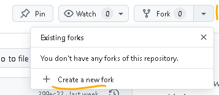
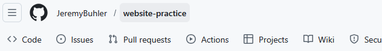
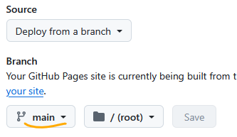

<!-- .slide: data-background="steelblue" data-transition="none-in none-out" -->
## Git, GitHub, and GitHub Pages 
<br/><br/>
  
**Jeremy Buhler**  
*Data Librarian, UBC Library*  
jeremy.buhler@ubc.ca <!-- .element style="color:lightblue" --> 
<br/><br/>
slides: <https://bit.ly/git-ubc-library> <!--.element style="color: lightblue" -->


Note:


---

<!-- .slide: data-transition="none-in slide-out" -->
### Part 1: Orientation to Git and GitHub
Adapted from [Introduction to Git and GitHub](https://ubc-library-rc.github.io/intro-git/)   
<br/>
### Part 2: Publishing with GitHub Pages 
Adapted from [Introduction to Jekyll and GitHub Pages](https://ubc-library-rc.github.io/intro-jekyll/)

notes: resources for self-paced learning, click down to view/explore one of the websites 

--

<!-- .slide: data-background-iframe="https://ubc-library-rc.github.io/intro-git/" data-background-interactive -->

---

<!-- .slide: data-background="orange" data-transition="slide-in none-out" -->
## Part 1: Orientation to Git and GitHub


---

<!-- .slide: data-transition="none" -->
### Learning objectives

Describe what Git does and why that's useful <!-- .element class="fragment" -->

Feel more confident exploring Git and GitHub <!-- .element class="fragment" -->


notes: Opportunity to talk about expectations, how you hope to interact, etc. This first session we'll take extra time to bring everyone along. For those of you with related experience this may seem slow... If so, feel free to move ahead

---

<!-- .slide: data-background="green" data-transition="none-in slide-out -->
### Who are you? Why are you here?

notes: class discussion

---

<!-- .slide: data-transition="slide-in none-out" -->
### Outline and activities 

- Setup the environment and tools
- Learn basic Git concepts and terminology
- Create a local Git repository to track changes
- Create a remote Git repository on Github
- Link local and remote repositories


notes: 


---

<!-- .slide: data-background="orange" data-transition="none-in slide-out" -->
## Environment and tools 

notes: talk about different options for interacting with Git, and the reason we're using the command line in today's session.

---

<!-- .slide: data-transition="slide-in slide-out" -->
### What you'll need

- Git [installed](https://git-scm.com/book/en/v2/Getting-Started-Installing-Git) 
- Access to the command line
    - Windows: PowerShell <!-- .element style="font-size: smaller; color:gray" -->
    - Mac: Terminal <!-- .element style="font-size: smaller; color:gray" -->
- A text editor    
    - Windows: Notepad <!-- .element style="font-size: smaller; color:gray" -->
    - Mac: TextEdit <!-- .element style="font-size: smaller; color:gray" -->
- GitHub account (<https://github.com/signup>)
    

Note: For TextEdit, the default is to open in Rich Text. Change this under "Format -> Make Plain Text." This can be changed to the default for all new files under "Settings -> New Document -> Plain Text"

---

<!-- .slide: data-background="linen" data-transition="none-in slide-out" -->
### Environment check 

Can you access Git on the command line?  
Open PowerShell or Terminal and run this command:

```bash
$ git -v
``` 

```bash
git version 2.51.0.windows.1
``` 
<!-- .element class="fragment" --> 

<br/>

The "$" indicates the command prompt and is not part of the command <!-- .element class="small" -->

Notes: We're going to spend time to make sure we're all on the same page and can orient/navigate in the command line. For how many is command line brand new? If you have experience, help others, etc. 

---

<!-- .slide: data-background="linen" -->
### Set username and email 

Run these two commands <!-- .element class="left" -->
```bash
$ git config --global user.name "Your Name"
$ git config --global user.email "your.email@address.com"
```
Check with these commands <!-- .element class="left" --> 
```bash
$ git config --global user.name
$ git config --global user.email
```
<br/>

These settings are required; email should match your GitHub account email <!-- .element class="small" -->

---

<!-- .slide: data-background="linen" -->
### Navigate to desired location 

In the command line interface run... <!-- .element class="left" --> 
```bash
$ cd ~
```
...to move to your home directory <!-- .element class="left" -->
<br/><br/>  

"cd" stands for "change directory" and "~" represents the user's home directory <!-- .element class="small" -->

--

<!-- .slide: data-background="linen" -->
To double-check your directory, run <!-- .element class="left" -->  

```bash
$ pwd
```  

```bash
C:\Users\jeremybu
```
<!-- .element class="fragment" -->  
<br/>  

"pwd" stands for "print working directory" <!-- .element class="small" -->


notes: if you recognize this location and know you can get back to it, you're ready to move on

--

<!-- .slide: data-background="linen" -->
From "home" you can often move to the Desktop <!-- .element class="small" -->

```bash
$ cd Desktop
```

notes: You don't need to do this on the Desktop, but make sure you save your files in a place you recognize and can get back to in a file browser or on the command line.

---


<!-- .slide: data-background="green" data-transition="none" -->
### Setup questions? 

notes: class discussion, troubleshooting

---


<!-- .slide: data-background="orange" data-transition="none-in slide-out" -->
## Git concepts and terminology

Notes: Git is version control software. Ask class about version control: what they understand it to be, when it's useful


---

### Version control

- versioning <!-- .element class="fragment" -->
- collaboration <!-- .element class="fragment" -->
- rolling back <!-- .element class="fragment" -->
- understanding context <!-- .element class="fragment" -->
- backup <!-- .element class="fragment" -->


notes: Versioning - It provides a thorough log of changes to tracked files without creating multiple copies, making it easier to identify the most current version. Git creates a timeline of commits, which are snapshots of your project at specific points.

Collaboration - Version control helps teams work collaboratively on the same set of documents without interfering with each other. It allows for easy merging of changes made by different team members, helping to prevent conflicts and maintain a coherent codebase. Git also facilitates code reviews, where team members can provide feedback and suggest improvements before merging changes.

Rolling back - Made a mistake? Version control lets you review and undo changes, reverting to previous stages in the document’s history. This can be useful when changes to your files introduce unforeseen problems.

Understanding context - Version control can help you understand how the code or writing came to be, who wrote or contributed particular parts, and who you might ask to help understand it better.

Backup - By using Git, your codebase is stored locally on your machine as well as on remote repositories. This provides a built-in backup mechanism, reducing the risk of losing your code due to hardware failure or accidental deletions.

---

**Git:** open source tool installed locally to track changes to a set of files (referred to as a _repository_)

<p><b>GitHub:</b> a popular website for hosting and sharing Git repositories</p><!-- .element class="fragment" --> 


notes:

---


notes: If you think of Git as taking snapshots of changes over the life of a project, git add specifies what will go in a snapshot (putting things in the staging area), and git commit then actually takes the picture and makes a permanent record of it (as a commit). If you don’t have anything staged when you type git commit, Git will prompt you to use git commit -a or git commit --all. This will automatically stage and commit all changes to all files in your repository at once, so use this option with caution.


---

| Command | Description |
| --- | --- |
| `git init` | tell Git to start tracking activity in a directory |
| `git status` | find out which files have changed since the last snapshot |
| `git add` | tell Git which changed files to include in the next snapshot |
| `git commit` | take a new snapshot |

---

<!-- .slide data-transition="slide-in none-out" -->
Git is optimized for text files


notes:

---

<!-- .slide: data-background="green" data-transition="none-in none-out" -->

### Questions and clarification 

notes: class questions and troubleshooting 


---

<!-- .slide: data-background="orange" data-transition="none-in-slide-out" -->
## Create local Git repository

notes: There are many ways to interact with Git, but understanding how the basics work, on the command line, can help you orient when using other systems. By choosing this route I'm not saying it's the best, but I think there's some value to learning what's happening at the command level - that basic understanding will be transferrable to whatever GUI software you happen to integrate with Git later, whether it's RStudio, VSCode, GitHub Desktop, etc.

---

<!-- .slide: data-background="linen" -->
### Create a directory for your work

Make new directory called "git-practice" <!-- .element class="left" -->

```bash
$ mkdir git-practice
```
<br/> 

...then move into the directory <!-- .element class="left" -->
```bash
$ cd git-practice
```
<br/>

"mkdir" stands for "make directory" <!-- .element class="small" -->

---

<!-- .slide: data-background="linen" -->
### Make it a repository 

From within the "git-practice" directory, run <!-- .element class="left" --> 

```bash
$ git init
```

```bash

Initialized empty Git repository in 
C:/Users/jeremybu/Desktop/git-practice/.git/
  
```
<!-- .element class="fragment" -->

notes: So far all you've done is create a directory. How will Git know that you want to track this directory, to make it a Git repository? We do this with the `git init` command, which initializes the repository. You can do this in an empty repository as we are now, or in a repository that already has files... just remember that Git can only track activity after you use `git init`

The message says this is now an empty Git repository. Looking at this command, can any one guess or tell me what's changed so that Git knows this is a repository?

--

<!-- .slide: data-background="linen" -->
View the hidden ".git" directory

Mac <!-- .element style="text-align:left; padding-left: 5%" -->
```bash
$ ls -a
```
<br/> 

Windows <!-- .element style="text-align:left; padding-left: 5%" -->
```bash
$ ls -force
```

notes: The trick here is that in every Git repository there's a "hidden" directory named `.git`, where all the metadata and change information about the repository is stored.

---

<!-- .slide: data-background="linen" -->
### Make changes and check status

Check status of "git-practice" repository

```bash
$ git status
```

```bash
On branch main

No commits yet

Nothing to commit (create/copy files and use "git add" to track)
```
<!-- .element class="fragment" --> 

notes: Git is telling us things to orient. We know some of the terminology, so we can understand a little about what's happening. One thing that's new is the concept of a "branch." We won't use it now, but it's important.

--

<!-- .slide: data-background="linen" -->
Make a new text file

Mac <!-- .element class="left" -->
```bash
$ touch firstfile.txt && open -e firstfile.txt
```
<br/> 

Windows <!-- .element class="left" -->
```bash
$ notepad firstfile.txt
```

--

<!-- .slide: data-background="linen" -->
Edit and save file, then check status again<!-- .element class="left" -->

```bash
$ git status
```

```bash
On branch main

No commits yet

Untracked files:
  (use "git add <file>..." to include in what will be committed)
        firstfile.txt

Nothing added to commit but untracked files present 
(use "git add" to track)
  
```
<!-- .element class="fragment" --> 


---

<!-- .slide: data-background="linen" -->
### Add file and commit 

Add "firstfile.txt" to the staging area <!-- .element class="left" --> 
```bash
$ git add firstfile.txt
```

```bash
$ git status
On branch main

No commits yet

Changes to be committed:
  (use "git rm --cached <file>..." to unstage)
       new file:    firstfile.txt

```
<!-- .element class="fragment" --> 

notes: The previous command told us that we've changed something, and how to add it to tracking. After adding it, it gives us a hint that the next stage is to commit the staged changes. 

--

<!-- .slide: data-background="linen" data-transition="slide-in none-out"  -->
Commit the staged files with a note <!-- .element class="left" -->
```bash
$ git commit -m "adding first file to repository"
```

```bash
[main (root-commit) 4b323b9] adding first file to repository
 1 file changed, 5 insertions(+)
 create mode 100644 firstfile.txt
```
<!-- .element class="fragment" --> 

notes: if we run git status again, it says somethign like "nothing to commit, working tree clean", meaning that nothing's changed since the last commit.


---

<!-- .slide: data-background="green" data-transition="none-in none-out" -->

### How does this feel so far? 

notes: too fast, too slow? Are there questions about why this work is important?


---

<!-- .slide: data-background="orange" data-transition="none-in slide-out" -->
## Create a repository on GitHub 

notes: 

---

### Why bother?

<https://github.com/jeremybuhler/slides/>

notes: What makes this all worthwhile? Show how you use it to support workshops like this

--


--

- edit locally with preferred text editor
- content written in [Markdown](https://www.markdownguide.org/) syntax
- render as slides with [reveal.js](https://revealjs.com)
- publish with GitHub pages

notes: good for collaboration; for developing across different workstations (work at home, work at office); for keeping slides available after presentations; for sharing across platforms and devices (everyone has a browser).

---

### Sign in to GitHub  
<https://github.com/>

notes:

--- 

### Next steps

- Create a _Personal Access Token_
- Create a repository
- Link _git-practice_ repository to GitHub
- Use _pull_ and _push_ to sync repositories

---

<!-- .slide: data-background="linen" -->
### Create a _Personal Access Token_

1. go to <https://github.com/settings/tokens>
2. click _Generate new token_ button (top right)
3. select _Generate new token (classic)_
4. enter a _Note_ to identify the token (required)
5. under _Select scopes_, check the first _repo_ box
6. click _Generate token_ button
7. copy token and save it for later

notes: explain why this is necessary. Show the steps online but provide this slide for anyone who gets lost or needs to find it again. Can also be found under _Profile -> Settings -> Developer Settings -> Personal Access Tokens -> Tokens (classic)_. We're choosing classic because they're account wide, not just for repository, so they'll work with our other repositories next week.

---

<!-- .slide: data-background="linen" -->
### Create a GitHub repository

On GitHub home page, click the "+" menu and select _New repository_


--

<!-- .slide: data-background="linen" -->
- enter repository name (e.g. "git-practice")
- leave all else as default
- click _Create repository_

---

<!-- .slide: data-background="linen" -->
### Link local repository to GitHub


--

<!-- .slide: data-background="linen" -->
On the command line, in the "git-practice" directory <!-- .element class="left" -->

```bash
$ git remote add origin https://github.com/<username>/git-practice.git
  
```
Then: <!-- .element class="left" -->

```bash
$ git push -u origin main
```

note: explain what "origin" and "main" refer to, and why they might need to rename the branch "main" with _git branch -M main_

--

<!-- .slide: data-background="linen" -->
You will be prompted for credentials

- GitHub username
- Password = Personal Access Token


---

__git pull__ downloads GitHub changes to local repository

<p class="fragment"><b>git push</b> sends local committed changes to GitHub</p>

---

<!-- .slide: data-background="linen" -->
### Test pull/push

1. Create a new file on GitHub
2. On the command line, download the changes with `git pull`
3. Add or edit a local file, then stage and commit it
4. On the command line, push the change to GitHub with `git push`


---

<!-- .slide: data-background="orange" -->
## Feedback and looking ahead

<div style="height: 50vh">

</div>

[Feedback survey](https://ubc.ca1.qualtrics.com/jfe/form/SV_0MtLRW33U8lIp8x?title=Git1&presenter=jeremy&date=2021-01-26) for part 1

---

<!-- .slide: data-background="steelblue" -->
## End of part 1... thank you!
---

<!-- .slide: data-background="orange" data-transition="slide-in none-out" -->
## Part 2: Publishing with GitHub Pages 


---

<!-- .slide: data-transition="none" -->
### Learning objectives

Understand GitHub features that support collaboration <!-- .element class="fragment" -->

Publish a repository as a website <!-- .element class="fragment" -->


notes: 

---

<!-- .slide: data-background="green" data-transition="none-in slide-out -->
### Questions from last session, goals for this one

notes: class discussion. Clarify that while these sessions draw on the content offered by the research commons, they are significatnly different in content and order and are an attempt to cover the topics Julia expressed interest in during our initial correspondence.

---

<!-- .slide: data-transition="slide-in none-out" -->
### Outline and activities 

- Tour of GitHub collaboration features
- Orientation to GitHub Pages
- Publish a repository as website or slides


notes: 

---

### Quick review: Git and GitHub

notes: in particular, distinguish between Git and Github; also walk through the steps involved in the Git workflow (pull, add (stage), commit (take snapshot), push) 

---

<!-- .slide: data-background="orange" data-transition="none-in slide-out" -->
## Tour of GitHub collaboration features

notes: 

---

| Term | Description |
| --- | --- |
| **clone** | create a local copy of the repository on your computer |
| **fork**  | create a copy of a GitHub repository in your own GitHub account; you have full control over the new copy | 
| **pull request** | propose changes to a repository that you forked |

notes: some GitHub terms for collaboration. With Git we talked about pushing and pulling to keep your work in sync with a copy of the repository on GitHub. As we explore GitHub more, there are a few other terms and actions to be aware of. These features allow groups to collaborate, and to allow total strangers to suggests enhancements to a project.

---

<!-- .slide: data-background="linen" -->
### Forking example

To fork Jeremy's _git-practice_ repository <br/><https://github.com/jeremybuhler/git-practice>



notes: last week we created a repository called "git-practice" that we're going to use again today. If you weren't here, you can catch up quicky by forking my "git-practice" repository. this will create a copy of it in your own GitHub account, where you have full control to modify it and change the settings. 

---

### Other collaboration tools



- **Issues** track project-related tasks
- **Actions** automate processes 
- **Wiki** allows notes and documentation

notes: In any repository you'll have a few other options to facilitate collaboration. Brief tour of each, use a repository where they're relevant

---

### Issues example

Template repository for UBC Library workshops
<https://github.com/ubc-library-rc/template/issues?q=is%3Aissue>


notes: the template repository controls how UBC Library Research Commons workshops display. It standardizes many aspects for continuity across RC workshops.

---

### Actions example

Public list of Research Commons workshops
<https://ubc-library-rc.github.io/all.html>


notes: 

--

<!-- .slide: data-background-iframe="https://ubc-library-rc.github.io/all.html" data-background-interactive -->

--

#### What the _action_ does every night

1. Get metadata for all repositories via API 
2. Use repository tags to identify what to list
3. Generate list from title, url, and tag metadata
4. Publish the updated list

notes: in this workflow, repository owners make sure their repos have the metadata that identifies them for inclusion in the list. No one needs to update the list - that happens automatically every night, so the list stays current

---

<!-- .slide: data-background="orange" data-transition="none-in slide-out" -->
## Orientation to GitHub pages


notes: 

---

### Overview of the process 

- Owner turns on Pages for the repository <!-- .element class="fragment" -->
- GitHub uses Jekyll to create webpages <!-- .element class="fragment" -->
- The webpages are hosted on GitHub servers <!-- .element class="fragment" -->
- When files change, GitHub updates the site <!-- .element class="fragment" -->

notes: This is the first mention of Jekyll, spend some time with it

---

<!-- .slide: data-background="linen" -->
### Activate GitHub pages

1. Open your own "git-practice" repository
2. Go to _Settings -> Pages_
3. Choose the branch to publish, then _Save_




notes: some hands on activity now. Last week we created the "git-practice" repository.

---

### URL of published sites

- repository name: **git-practice**
- owner username: **jeremybuhler**
- URL: <https://jeremybuhler.github.io/git-practice>

notes: the url for published sites follows a pattern based on the GitHub username and the repository name. It's also possible to use your own domain name. 

---
<!-- .slide: data-background="green" data-transition="none-in slide-out -->

Does it work?

notes: some people will not have a readme file, others probably will. Use this for troubleshooting and discussion.

---

### Website home page

GitHub looks for one of these files to use as the website homepage (in this order)

1. index.html
2. index.md
3. readme.md

notes: if you don't have one of these files, add one to git-practice, then wait for the site to regenerate

---

<!-- .slide: data-background="green" data-transition="none-in slide-out -->

Questions and clarifications

---

<!-- .slide: data-background="orange" data-transition="none-in slide-out" -->
## Explore, play, practice

notes: at this stage, ask group how many want to practice building a website, how many want to create some presentation slides, and how many would like to try both

---

<!-- .slide: style="font-size: 0.8em" -->
#### Option 1: publish a website
1. Fork <https://github.com/jeremybuhler/website-practice>
2. Turn on _Pages_ in the forked repository
3. Explore the relationship between files and site
4. Optional: add a new page with an image  
<br/>
<br/>
#### Option 2: publish presentation slides
1. Fork <https://github.com/jeremybuhler/reveal-practice>
2. Turn on _Pages_ in the forked repository
3. Explore the relationship between files and site
4. Optional: add a slide with an image


---
<!-- .slide: data-background="steelblue" data-transition="none-in none-out" -->

## Thank you 
